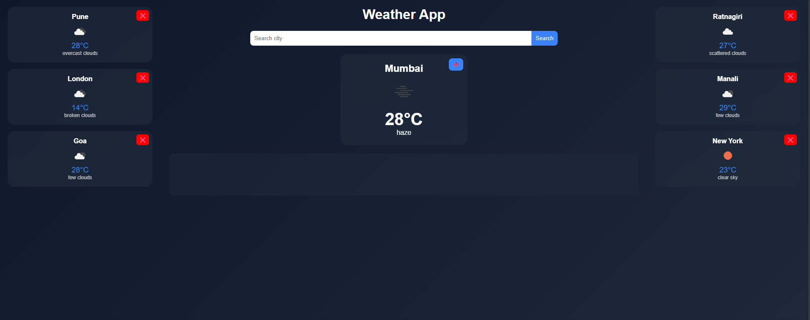
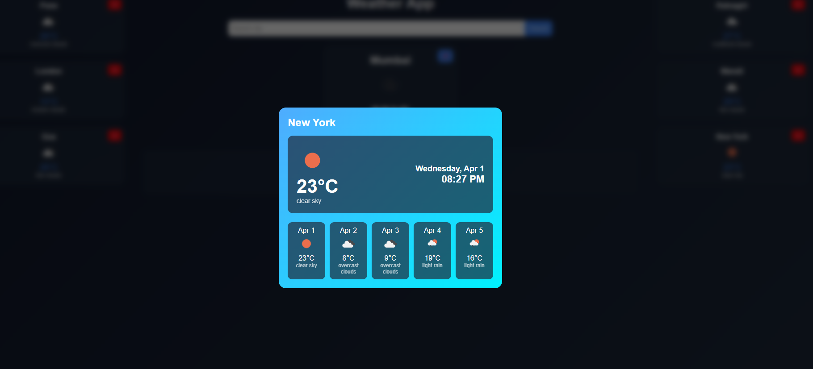

# 🌦 Weather App

A modern and responsive weather application built using **HTML, CSS, and JavaScript**, featuring real-time weather data, dynamic UI, and an interactive user experience.

---

## 🚀 Features

### 🌍 Core Features

* Search weather by city
* Real-time data using OpenWeatherMap API
* Display temperature, weather condition, and icons
* Error handling for invalid city inputs

### 📌 Advanced Features

* Pin / unpin cities to sidebar
* Dynamic sidebar with persistent data (localStorage)
* Always-visible 6-slot sidebar system

### 🪟 Interactive UI

* Clickable weather cards
* Modal popup with smooth animations
* Click outside to close modal

### 📊 Forecast System

* 5-day weather forecast
* Combined view:

  * Current weather (today)
  * Forecast (next 5 days)
* Clean vertical layout inside modal

### 🎨 UI & UX Enhancements

* Clean modern design
* Glassmorphism-style cards
* Smooth hover effects and animations
* Dynamic background in forecast modal
* Improved spacing and typography
* Date and time display in modal

---

## 🛠 Tech Stack

* HTML5
* CSS3
* JavaScript (Vanilla)
* OpenWeatherMap API

## 🧠 Development Approach

This project was built with a focus on clean UI/UX and structured development.  
Tools like ChatGPT were used for guidance, debugging, and improving code quality.

---

## 📱 Responsive Design

* Mobile-friendly layout (custom design in progress)
* Horizontal scrolling sidebar on smaller screens
* Optimized modal for mobile view

---

## 📸 Screenshot

---

## 🌐 Live Demo

*Add your deployed link here*

---

## 📌 Future Improvements

* Auto-detect user location
* Drag & reorder pinned cities
* Weather-based animations (rain, snow, etc.)
* UI enhancements for mobile experience

---

## 👨‍💻 Author

**Arya Patil**
GitHub: https://github.com/web-aryacodes

---

## ⭐ Project Status

✅ Completed core features
🚀 Ready for deployment

